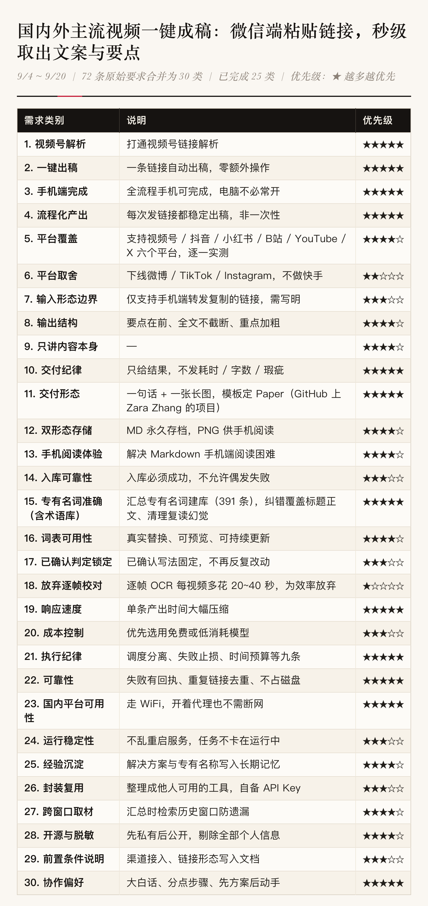

# 一键成稿 · Video2Draft
（当前仅限国内外六平台视频分享链接 → 发送微信ClawBot → 一键提取文案生成 图片*1张+文案.md *一份）→ WorkBuddy处理

**国内外主流视频，一条链接 → 可读文案与要点，秒级出稿。**

微信端把视频链接发给机器人，几十秒后收到：结构化要点 + 完整文案 + 排版长图。
也可以不接微信，纯命令行本地出稿（MD + PNG + 结果 JSON）。



## 支持平台

| 平台 | 状态 | 取流方式 |
|---|---|---|
| 抖音 | ✅ 已实现 | 仓库安装的 yt-dlp |
| B站 | ✅ 已实现 | 仓库安装的 yt-dlp |
| YouTube | ✅ macOS 已实测通过 | 仓库安装的 yt-dlp（机房/VPN 出口可能触发 `Sign in to confirm you're not a bot`，用 `YJCG_COOKIES_FROM_BROWSER` 或 `YJCG_COOKIE_FILE` 带登录态） |
| 小红书 | ✅ 已实现 | 纯 Python 解析分享页 |
| X (Twitter) | ✅ 已实现 | 公开接口 + yt-dlp 兜底 |
| 视频号 | ⚠️ macOS 已验证 / **Windows 未验证** | 可选第三方服务（需自行配置） |

微博 / TikTok / 快手：不做，识别到只会回一句说明。

## 运行环境

| 系统 | 状态 | 说明 |
|---|---|---|
| macOS | ✅ 已实测 | 开发与验收环境；含真实 YouTube 链接端到端（出 MD + PNG） |
| Windows | ⚙️ 部分已实测（CI） | **基础测试与离线全管线端到端已在 GitHub Actions 的 `windows-latest` 实测通过**（ffmpeg 抽音频 → faster-whisper 转写 → MD → PNG，用 Chrome 无头出图）；**但「真实 YouTube 链接」这一步在 CI 上被 YouTube 反爬拦截**（机房 IP，`Sign in to confirm you're not a bot`），所以**不能算 Windows 已验证**——需要在有登录态的 Windows 机器上跑一次（`YJCG_COOKIES_FROM_BROWSER=edge`） |
| Linux | ⚙️ 理论可用 | 未实测 |

CI：<https://github.com/Melinda-Mel/Video2Draft/actions/workflows/cross-platform.yml>（macOS + Windows 双系统）

> Windows 真机怎么把这最后一步跑出来并留证：见 [docs/12-Windows真机验收.md](docs/12-Windows真机验收.md)
> —— 可复制运行的 PowerShell 步骤、每步预期结果、产物路径与通过标准。

## 安装

```bash
# macOS / Linux
bash install.sh
```

```powershell
# Windows（PowerShell）
powershell -ExecutionPolicy Bypass -File install.ps1
```

脚本会检查 Python ≥3.10、pip、ffmpeg、Chrome（出图用），并提示每一项的安装命令；加 `--check` / `-Check` 只检查不安装。

要装的东西只有三样：**Python 3.10+**、**ffmpeg**、**Chrome/Chromium**（只影响出图，不影响出 MD）。

## 快速开始

```bash
# macOS / Linux
python3 tools/video2draft.py "<视频链接>"
python3 tools/video2draft.py "<链接>" --platform 抖音     # 平台识别失败时手动指定
python3 tools/video2draft.py --doctor                    # 环境自检
```

```powershell
# Windows（注意命令是 python，不是 python3）
python tools\video2draft.py "<视频链接>"
python tools\video2draft.py "<链接>" --no-push
```

输出（默认在 `~/Video2Draft`，Windows 是 `%USERPROFILE%\Video2Draft`）：

- `<标题>.md` — 成品文案；**没配 DeepSeek Key 时自动退化为「标题 + 原始转写稿」**，流程不中断
- `<标题>.png` — 排版长图；**出图失败不影响 MD 产出**，只是少一张图
- `<标题>.json` — 结果 JSON（标题 / 作者 / 时长 / 字数 / 路径 / 各步骤状态）

> `--no-push` 是兼容旧命令保留的参数：本 CLI 从来不推送，也不需要安装任何微信发送组件。
> 微信收发由外层（WorkBuddy 等宿主）负责，核心程序只出 MD / PNG / JSON。

## 配置（环境变量）

| 变量 | 默认 | 说明 |
|---|---|---|
| `YJCG_OUTPUT_DIR` | `~/Video2Draft` | 输出目录（与代码目录解耦） |
| `YJCG_TMP_DIR` | 系统临时目录 | 中间产物 |
| `YJCG_FFMPEG` | PATH 中的 ffmpeg | ffmpeg 路径 |
| `YJCG_CHROME` | 自动探测 | 出图用浏览器 |
| `YJCG_WHISPER_MODEL` | `small` | tiny / base / small / medium / large |
| `YJCG_COOKIES_FROM_BROWSER` | 空 | 如 `chrome`，给 yt-dlp 带登录态 |
| `YJCG_COOKIE_FILE` | 空 | Netscape 格式 cookies 文件 |
| `YJCG_SPH_ENDPOINT` | 空 | 视频号第三方解析服务地址（不设 = 该能力关闭） |
| `DEEPSEEK_API_KEY` | 空 | 不设则输出原始转写稿 |

云端整理用 DeepSeek：设 `DEEPSEEK_API_KEY`，或复制 `tools/.sph_config.json.example` 为 `tools/.sph_config.json` 填 Key。

## 能力边界（诚实版）

- **视频号**需要自建第三方解析服务（上游 `ltaoo/wx_channels_download`）且依赖微信 PC 在线；本项目只在 macOS 上验证过，**Windows 未验证，因此不标记为支持**。
- **YouTube** 在机房/VPN 出口可能触发「Sign in to confirm you're not a bot」：在本机浏览器登录后设 `YJCG_COOKIES_FROM_BROWSER=chrome` 即可。
- 链接形态只验证过「手机端点击转发后复制的那条链接」。
- 专有名词纠错内置 394 条词表（`tools/fix_terms.py`），覆盖科技/创投/区块链等 10 个领域。
- 转写在本机离线完成（faster-whisper），音频不出机器。
- 首次运行会下载 whisper 模型（tiny≈75MB / small≈500MB）。

## 目录结构

```
tools/video2draft.py    跨平台 CLI（推荐入口）
tools/v2d/              内核：config / audio / transcribe / render
tools/adapters/         平台适配器：yt-dlp、小红书、X、视频号（可选）
tools/md2pic.py         长图渲染（仓库自带，用当前解释器调用）
tools/fix_terms.py      术语库与纠错
tools/format_doc.py     文案整理（DeepSeek 可选）
tools/{pipeline,make_card,x_reply,xhs_reply,whisper_server}.py   Legacy（macOS 本机链路，保留不替换）
tests/                  跨平台基础测试
docs/                   设计文档
```

## 测试

```bash
python -m unittest discover -s tests -v     # 跨平台红线 + 降级路径 + 出图冒烟
```

CI（`.github/workflows/cross-platform.yml`）在 `macos-latest` 与 `windows-latest` 上跑语法检查、单元测试、出图冒烟与环境自检。

## 文档

全套设计文档在 [`docs/`](docs/)（共 15 份文件，编号 00–12）：总览与平台矩阵、卡点与解决、术语库、可移植性拆分、需求全集、Windows 真机验收步骤等。

## License

MIT — 见 [LICENSE](LICENSE)。
